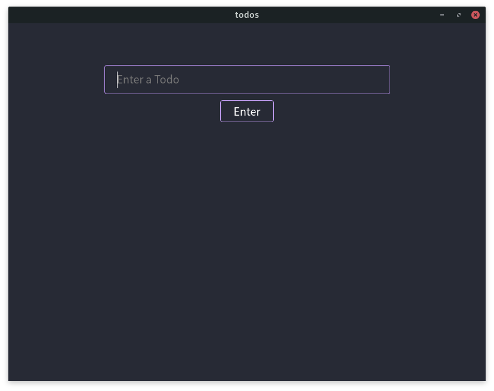
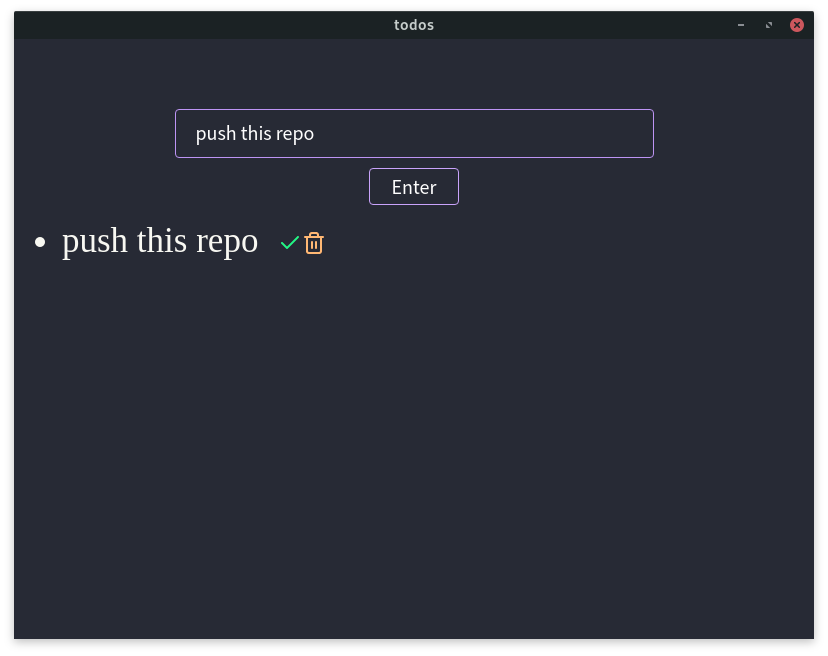
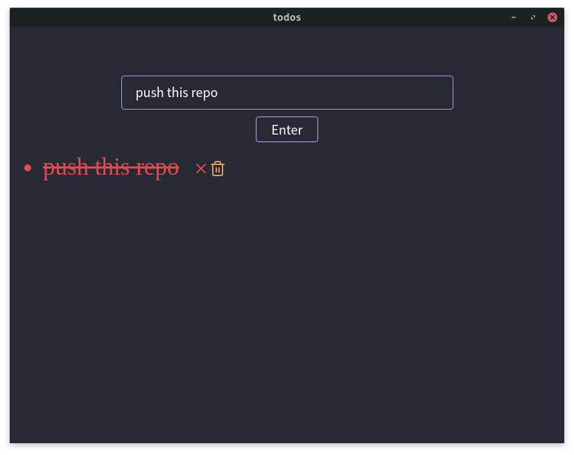
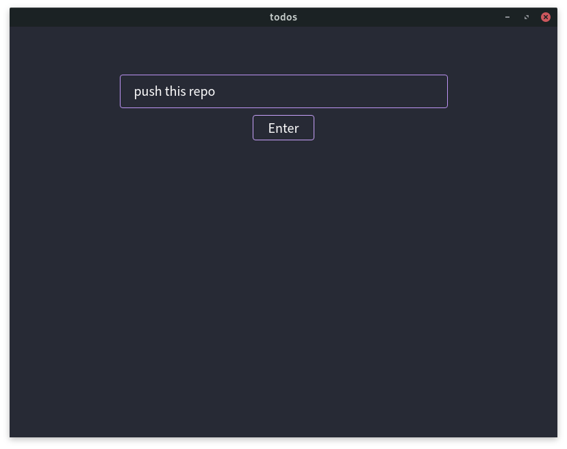

# 📑 Simple to do list with electron and NextJs 📋



## This Have the same idea of orders to do lists apps, but this have [dracula theme](https://draculatheme.com/) by default :)

### Add to do



### Complete to do



### Delete to do



## Running

```
  yarn start #--> with production pages
    or
  yarn dev   #--> with development pages
```

### Made with 🧡 and 🧠 by [Dpbm](https://github.com/Dpbm)
